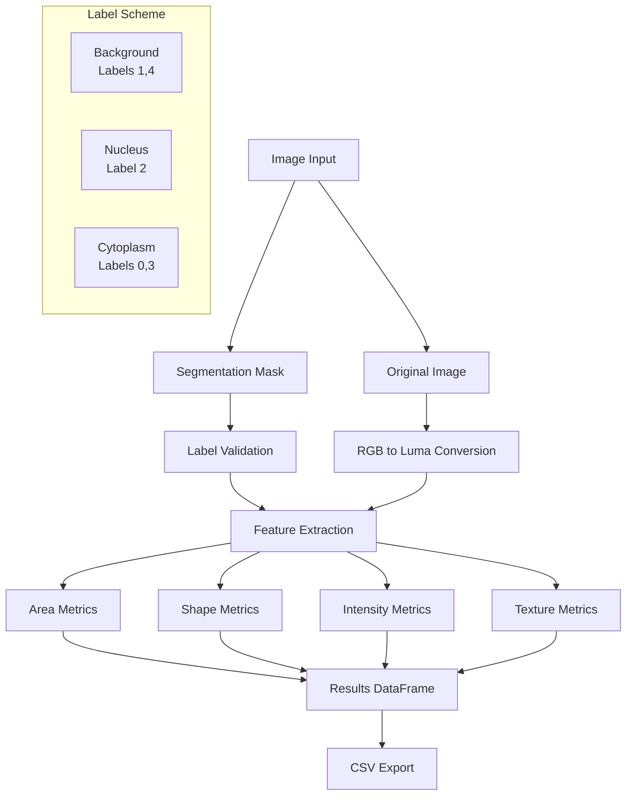

# CellSeg-3C: Cell Segmentation and Feature Extraction Tool

CellSeg-3C is a Streamlit-based web application for analyzing cell images and extracting morphological and intensity-based features. The tool processes segmented cell images to compute 20 distinct features plus a class label.

## Architecture



## Features

- **Input Support**:
  - Original image (optional): BMP, PNG, JPG, JPEG, TIF, TIFF
  - Segmentation mask (required): BMP, PNG, TIF, TIFF

- **Feature Categories**:
  1. Area Measurements
     - Nucleus area
     - Cytoplasm area
     - Nucleus/Cytoplasm ratio

  2. Shape Analysis
     - Major/Minor axis lengths
     - Elongation
     - Roundness
     - Perimeter

  3. Intensity Features
     - Mean intensity (nucleus)
     - Mean intensity (cytoplasm)

  4. Texture Analysis
     - Local maxima/minima count
     - Spatial distribution

## Usage

1. Launch the application using Streamlit:
   ```bash
   streamlit run pap_ui.py
   ```

2. Configure settings in the sidebar:
   - Set pixel size (µm/pixel) if needed
   - Select class label (1-7)

3. Upload images:
   - Original image (optional, for intensity features)
   - Segmented mask (required, with proper labels)

4. View results:
   - Pseudo-colored segmentation
   - Original image overlay
   - Feature measurements table
   - Download results as CSV

## Label Scheme

The tool uses a fixed labeling scheme:
- Background pixels: Labels 1 or 4
- Nucleus pixels: Label 2
- Cytoplasm pixels: Labels 0 or 3
