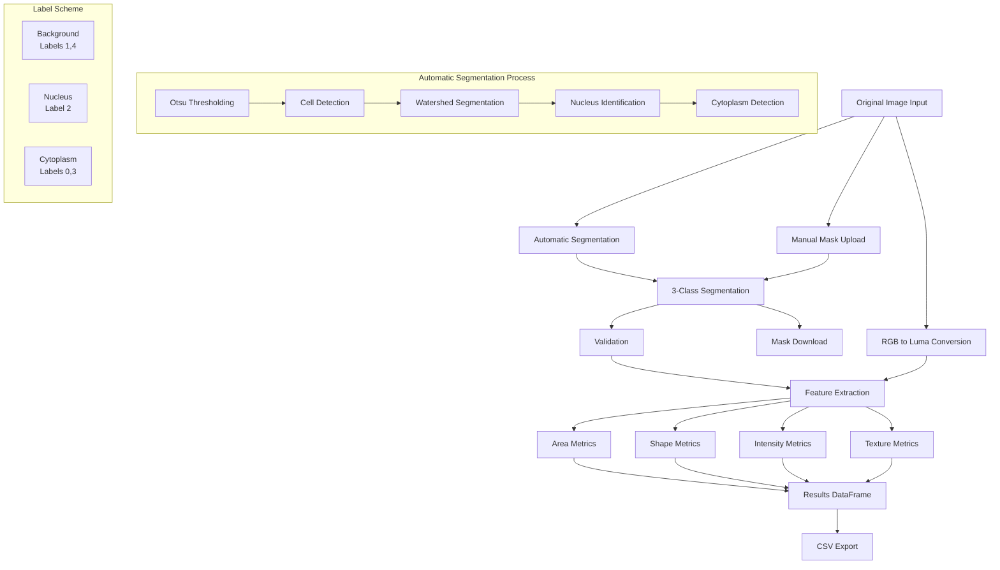

# CellSeg-3C: Automatic Cell Segmentation and Feature Extraction Tool

CellSeg-3C is a Streamlit-based web application for automatically segmenting cell images and extracting morphological and intensity-based features. The tool can automatically identify three regions in cell images: Background, Nucleus (Kerne), and Cytoplasm (Cyto), and compute 20 distinct features plus a class label.

## 🚀 New Features

- **🤖 Automatic Cell Segmentation**: Upload an original image and get automatic 3-class segmentation
- **🎨 Real-time Visualization**: See segmentation results with color-coded regions
- **⚙️ Advanced Parameters**: Fine-tune segmentation with customizable sensitivity settings
- **📥 Export Options**: Download both generated masks and feature data

## Architecture



## Features

- **🖼️ Dual Input Modes**:
  - **Automatic Segmentation**: Upload original image → Get automatic 3-class segmentation
  - **Manual Upload**: Original image (optional) + Pre-segmented mask (required)

- **🔬 Segmentation Algorithm**:
  - Otsu thresholding for cell boundary detection
  - Distance transform and watershed for nucleus/cytoplasm separation
  - Morphological operations for boundary refinement
  - Configurable sensitivity parameters

- **📊 Feature Categories**:
  1. **Area Measurements**
     - Nucleus area
     - Cytoplasm area  
     - Nucleus/Cytoplasm ratio

  2. **Shape Analysis**
     - Major/Minor axis lengths
     - Elongation
     - Roundness
     - Perimeter

  3. **Intensity Features**
     - Mean intensity (nucleus)
     - Mean intensity (cytoplasm)

  4. **Texture Analysis**
     - Local maxima/minima count
     - Spatial distribution

  4. Texture Analysis
     - Local maxima/minima count
     - Spatial distribution

## Usage

### 🤖 Automatic Segmentation

1. Launch the application:
   ```bash
   streamlit run pap_ui.py
   ```

2. Configure settings in the sidebar:
   - Set pixel size (µm/pixel) if needed
   - Select class label (1-7)
   - Adjust advanced segmentation parameters if needed

3. Upload original cell image:
   - Supported formats: BMP, PNG, JPG, JPEG, TIF, TIFF
   - The tool will automatically generate a 3-class segmentation

4. View results:
   - Auto-generated segmentation visualization
   - Original image overlay
   - Feature measurements table
   - Download segmentation mask and results as CSV

## 🎛️ Advanced Settings

- **Minimum Cell Size**: Controls the smallest detectable cell area (default: 500 pixels)
- **Nucleus Detection Sensitivity**: Adjusts how sensitive the algorithm is to detecting nucleus regions (default: 0.3)

## Label Scheme

The tool uses a fixed labeling scheme for both automatic and manual modes:
- **Background pixels**: Labels 1 or 4
- **Nucleus pixels**: Label 2  
- **Cytoplasm pixels**: Labels 0 or 3

## 🔧 Requirements

```bash
pip install streamlit pandas numpy pillow scikit-image opencv-python scipy
```
